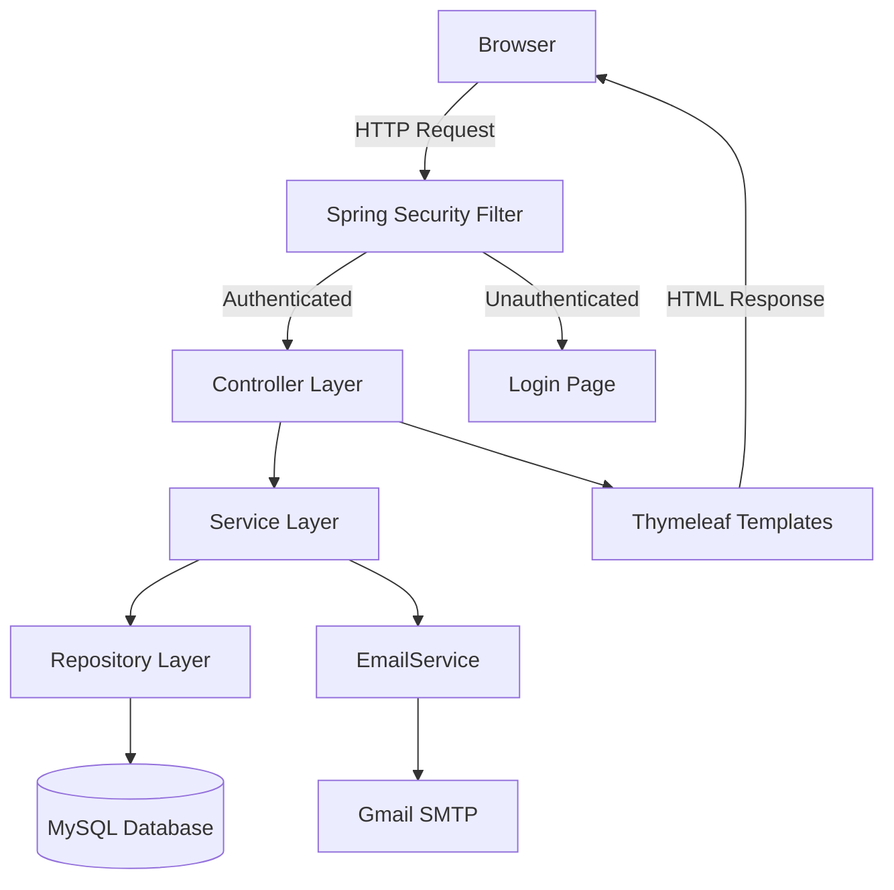
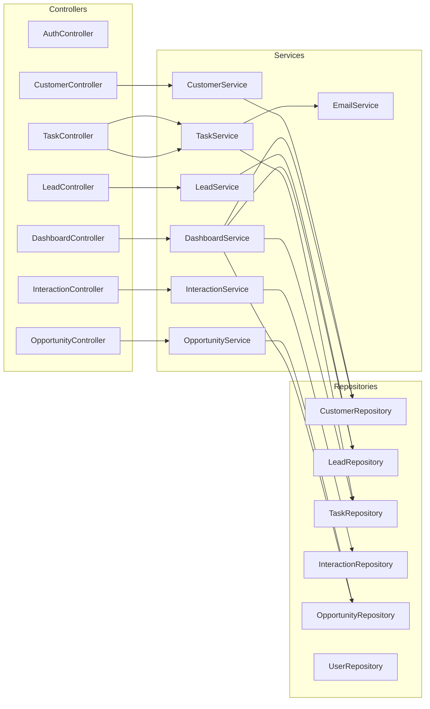
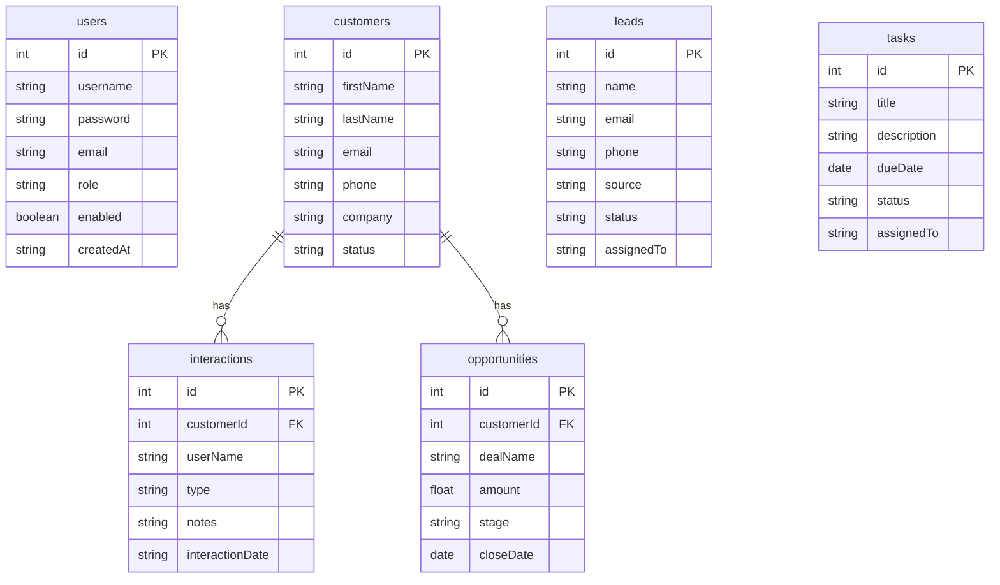
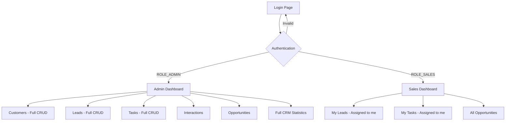

# Customer Relationship Management System

A full-stack CRM web application built with Spring Boot 3.2.3, MySQL, Thymeleaf, and Bootstrap 5. The system provides complete customer lifecycle management with role-based access control, search, pagination, Excel export, and email notifications.

---

## Table of Contents

- [Overview](#overview)
- [Tech Stack](#tech-stack)
- [Architecture](#architecture)
- [Database Schema](#database-schema)
- [Features](#features)
- [Project Structure](#project-structure)
- [Role-Based Access](#role-based-access)
- [Getting Started](#getting-started)
- [Configuration](#configuration)
- [Default Users](#default-users)
- [API Routes](#api-routes)

---

## Overview

This CRM system enables businesses to manage their customer relationships across the full sales pipeline. It covers customer records, lead tracking, task assignments, interaction history, opportunity management, and consolidated dashboard analytics — all protected by Spring Security with database-backed authentication.

---

## Tech Stack

| Layer | Technology |
|---|---|
| Backend Framework | Spring Boot 3.2.3 |
| Language | Java (OpenJDK 25) |
| Database | MySQL 8 |
| ORM | Spring Data JPA / Hibernate |
| Template Engine | Thymeleaf |
| Frontend Styling | Bootstrap 5 |
| Security | Spring Security 6 + BCrypt |
| Email | Spring Boot Mail (Gmail SMTP) |
| Excel Export | Apache POI 5.2.5 |
| Build Tool | Maven |
| Connection Pool | HikariCP |

---

## Architecture



---

## Application Layer Flow



---

## Database Schema



---

## Role-Based Access



---

## Features

### Authentication
- Database-backed login with BCrypt password hashing
- Role-based redirection after login
- Session management and secure logout

### Customer Management
- Full CRUD operations
- Search by first name or email (case-insensitive)
- Paginated list (10 per page) with Previous / Next controls
- Export all customers to Excel (.xlsx) with styled headers

### Lead Management
- Full CRUD with status tracking: NEW, CONTACTED, QUALIFIED, LOST
- Search by name or email
- Paginated list with controls
- Color-coded status badges

### Task Tracking
- Full CRUD with due date picker
- Status: PENDING, COMPLETED
- Email notification sent automatically when a new task is created

### Interaction History
- Log customer interactions by type: CALL, EMAIL, MEETING
- Datetime picker for interaction timestamp
- Filter and display per customer

### Opportunity Management
- Full CRUD with deal stage tracking: PROSPECT, NEGOTIATION, WON, LOST
- Amount formatted in Indian Rupee (Rs.)
- Revenue calculation from WON opportunities via JPQL SUM query

### Dashboard Analytics
- Admin view: Total Customers, Leads, Tasks, Opportunities, Revenue
- Sales view: My Leads count, My Tasks count, Opportunity count
- Latest 5 leads table on admin dashboard
- Role-based sections rendered via Thymeleaf sec:authorize

### Email Notifications
- Triggered only on new task creation (not on edit)
- Sends task title, description, due date, status, and assigned user
- Errors silently caught — task creation is never blocked

---

## Project Structure

```
customer-relationship-manager/
├── pom.xml
└── src/
    ├── main/
    │   ├── java/com/crm/
    │   │   ├── CrmApplication.java
    │   │   ├── config/
    │   │   │   └── DataInitializer.java
    │   │   ├── controller/
    │   │   │   ├── AuthController.java
    │   │   │   ├── CustomerController.java
    │   │   │   ├── DashboardController.java
    │   │   │   ├── InteractionController.java
    │   │   │   ├── LeadController.java
    │   │   │   ├── OpportunityController.java
    │   │   │   └── TaskController.java
    │   │   ├── entity/
    │   │   │   ├── Customer.java
    │   │   │   ├── Interaction.java
    │   │   │   ├── Lead.java
    │   │   │   ├── Opportunity.java
    │   │   │   ├── Task.java
    │   │   │   └── User.java
    │   │   ├── repository/
    │   │   │   ├── CustomerRepository.java
    │   │   │   ├── InteractionRepository.java
    │   │   │   ├── LeadRepository.java
    │   │   │   ├── OpportunityRepository.java
    │   │   │   ├── TaskRepository.java
    │   │   │   └── UserRepository.java
    │   │   ├── security/
    │   │   │   ├── CustomUserDetailsService.java
    │   │   │   └── SecurityConfig.java
    │   │   └── service/
    │   │       ├── CustomerService.java
    │   │       ├── DashboardService.java
    │   │       ├── EmailService.java
    │   │       ├── InteractionService.java
    │   │       ├── LeadService.java
    │   │       ├── OpportunityService.java
    │   │       ├── TaskService.java
    │   │       └── UserService.java
    │   └── resources/
    │       ├── application.properties
    │       ├── static/css/style.css
    │       └── templates/
    │           ├── dashboard.html
    │           ├── login.html
    │           ├── customers/
    │           │   ├── list.html
    │           │   └── form.html
    │           ├── leads/
    │           │   ├── list.html
    │           │   └── form.html
    │           ├── tasks/
    │           │   ├── list.html
    │           │   └── form.html
    │           ├── interactions/
    │           │   ├── list.html
    │           │   └── form.html
    │           └── opportunities/
    │               ├── list.html
    │               └── form.html
    └── test/
        ├── java/com/crm/CrmApplicationTests.java
        └── resources/application-test.properties
```

---

## Getting Started

### Prerequisites

- Java 17 or higher (tested on JDK 25)
- Maven 3.8+
- MySQL 8.0+
- Gmail account with 2-Step Verification enabled

### 1. Clone the repository

```bash
git clone https://github.com/yourusername/customer-relationship-manager.git
cd customer-relationship-manager
```

### 2. Create the database

```sql
CREATE DATABASE crm_db;
```

### 3. Configure application.properties

Edit `src/main/resources/application.properties`:

```properties
spring.datasource.url=jdbc:mysql://localhost:3306/crm_db?useSSL=false&serverTimezone=UTC
spring.datasource.username=root
spring.datasource.password=your_mysql_password

spring.mail.username=your_gmail@gmail.com
spring.mail.password=your_16_char_app_password
app.mail.notification.to=your_gmail@gmail.com
```

### 4. Run the application

```bash
./mvnw spring-boot:run
```

### 5. Access the application

Open your browser and navigate to:

```
http://localhost:8080
```

---

## Configuration

### Gmail App Password Setup

1. Go to https://myaccount.google.com/security
2. Enable 2-Step Verification
3. Go to https://myaccount.google.com/apppasswords
4. Create an app password named "CRM System"
5. Copy the 16-character password (remove spaces)
6. Paste into `spring.mail.password` in application.properties

### Database Auto-Configuration

The application uses `spring.jpa.hibernate.ddl-auto=update`. All tables are created automatically on first run. No manual SQL scripts are required.

---

## Default Users

The following users are seeded automatically on first application startup:

| Username | Password | Role | Dashboard Access |
|---|---|---|---|
| admin | admin123 | ROLE_ADMIN | Full CRM statistics and all modules |
| sales | sales123 | ROLE_SALES | Assigned leads, tasks, and opportunities |

---

## API Routes

### Authentication
| Method | Route | Description |
|---|---|---|
| GET | /login | Login page |
| POST | /logout | Logout |
| GET | /dashboard | Role-based dashboard |

### Customers
| Method | Route | Description |
|---|---|---|
| GET | /customers | List with search and pagination |
| GET | /customers/new | Add new customer form |
| POST | /customers | Save new customer |
| GET | /customers/edit/{id} | Edit customer form |
| POST | /customers/edit/{id} | Update customer |
| GET | /customers/delete/{id} | Delete customer |
| GET | /customers/export | Download customers.xlsx |

### Leads
| Method | Route | Description |
|---|---|---|
| GET | /leads | List with search and pagination |
| GET | /leads/new | Add new lead form |
| POST | /leads | Save new lead |
| GET | /leads/edit/{id} | Edit lead form |
| POST | /leads/edit/{id} | Update lead |
| GET | /leads/delete/{id} | Delete lead |

### Tasks
| Method | Route | Description |
|---|---|---|
| GET | /tasks | List all tasks |
| GET | /tasks/new | Add new task form |
| POST | /tasks | Save task and send email notification |
| GET | /tasks/edit/{id} | Edit task form |
| POST | /tasks/edit/{id} | Update task |
| GET | /tasks/delete/{id} | Delete task |

### Interactions
| Method | Route | Description |
|---|---|---|
| GET | /interactions | List all interactions |
| GET | /interactions/new | Add interaction form |
| POST | /interactions | Save interaction |
| GET | /interactions/delete/{id} | Delete interaction |

### Opportunities
| Method | Route | Description |
|---|---|---|
| GET | /opportunities | List all opportunities |
| GET | /opportunities/new | Add opportunity form |
| POST | /opportunities | Save opportunity |
| GET | /opportunities/edit/{id} | Edit opportunity form |
| POST | /opportunities/edit/{id} | Update opportunity |
| GET | /opportunities/delete/{id} | Delete opportunity |

